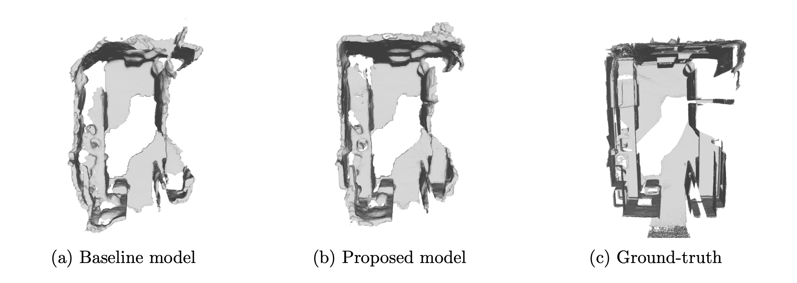

# NeuralRecon w/ Normal Features: Improving Real-Time Monocular 3D Indoor Scene Reconstruction
<br/>



> NOTE: This work uses NeuralRecon as its backbone.
> NeuralRecon: Real-Time Coherent 3D Reconstruction from Monocular Video  
> [Jiaming Sun](https://jiamingsun.ml)<sup>\*</sup>, [Yiming Xie](https://ymingxie.github.io)<sup>\*</sup>, [Linghao Chen](https://github.com/f-sky), [Xiaowei Zhou](http://www.cad.zju.edu.cn/home/xzhou/), [Hujun Bao](http://www.cad.zju.edu.cn/bao/)  
> CVPR 2021 (Oral Presentation and Best Paper Candidate)

<br/>

## How to Use

### Installation
```shell
# Ubuntu 18.04 and above is recommended.
sudo apt install libsparsehash-dev  # you can try to install sparsehash with conda if you don't have sudo privileges.
conda env create -f environment.yaml
conda activate neucon
```
<!-- Follow instructions in [torchsparse](https://github.com/mit-han-lab/torchsparse) to install torchsparse. -->

<details>
  <summary>[FAQ on environment installation]</summary>

 - `AttributeError: module 'torchsparse_backend' has no attribute 'hash_forward'`
   - Clone `torchsparse` to a local directory. If you have done that, recompile and install `torchsparse` after removing the `build` folder.

 - No sudo privileges to install `libsparsehash-dev`
   - Install `sparsehash` in conda (included in `environment.yaml`) and run `export CPLUS_INCLUDE_PATH=$CONDA_PREFIX/include` before installing `torchsparse`.

 - For other problems, you can also refer to the [FAQ](https://github.com/mit-han-lab/torchsparse/blob/master/docs/FAQ.md) in `torchsparse`.
</details>

### Pretrained Model on ScanNet
Download the [pretrained weights](https://drive.google.com/file/d/1zKuWqm9weHSm98SZKld1PbEddgLOQkQV/view?usp=sharing) and put it under 
`PROJECT_PATH/checkpoints/release`.
You can also use [gdown](https://github.com/wkentaro/gdown) to download it in command line:
```bash
mkdir checkpoints && cd checkpoints
gdown --id 1zKuWqm9weHSm98SZKld1PbEddgLOQkQV
```

### Real-time Demo on Custom Data with Camera Poses from ARKit.
We provide a real-time demo of NeuralRecon running with self-captured ARKit data.
Please refer to [DEMO.md](DEMO.md) for details.

### Data Preperation for ScanNet
Download and extract ScanNet by following the instructions provided at http://www.scan-net.org/.
<details>
  <summary>[Expected directory structure of ScanNet (click to expand)]</summary>
  
You can obtain the train/val/test split information from [here](https://github.com/ScanNet/ScanNet/tree/master/Tasks/Benchmark).
```
DATAROOT
└───scannet
│   └───scans
│   |   └───scene0000_00
│   |       └───color
│   |       │   │   0.jpg
│   |       │   │   1.jpg
│   |       │   │   ...
│   |       │   ...
│   └───scans_test
│   |   └───scene0707_00
│   |       └───color
│   |       │   │   0.jpg
│   |       │   │   1.jpg
│   |       │   │   ...
│   |       │   ...
|   └───scannetv2_test.txt
|   └───scannetv2_train.txt
|   └───scannetv2_val.txt
```
</details>

Next run the data preparation script which parses the raw data format into the processed pickle format.
This script also generates the ground truth TSDFs using TSDF Fusion.  
<details>
  <summary>[Data preparation script]</summary>

```bash
# Change PATH_TO_SCANNET and OUTPUT_PATH accordingly.
# For the training/val split:
python tools/tsdf_fusion/generate_gt.py --data_path PATH_TO_SCANNET --save_name all_tsdf_9 --window_size 9
# For the test split
python tools/tsdf_fusion/generate_gt.py --test --data_path PATH_TO_SCANNET --save_name all_tsdf_9 --window_size 9
```
</details>


### Inference on ScanNet test-set
```bash
python main.py --cfg ./config/test.yaml
```

The reconstructed meshes will be saved to `PROJECT_PATH/results`.


### Evaluation on ScanNet test-set
```
python tools/evaluation.py --model ./results/scene_scannet_release_fusion_eval_47 --n_proc 16
```

Note that `evaluation.py` uses pyrender to render depth maps from the predicted mesh for 2D evaluation.
If you are using headless rendering you must also set the enviroment variable `PYOPENGL_PLATFORM=osmesa`
(see [pyrender](https://pyrender.readthedocs.io/en/latest/install/index.html) for more details).

You can print the results of a previous evaluation run using
```
python tools/visualize_metrics.py --model ./results/scene_scannet_release_fusion_eval_47
```


### Training on ScanNet

Start training by running `./train.sh`.
More info about training (e.g. GPU requirements, convergence time, etc.) to be added soon.
<details>
  <summary>[train.sh]</summary>

```bash
#!/usr/bin/env bash
export CUDA_VISIBLE_DEVICES=0,1
python -m torch.distributed.launch --nproc_per_node=2 main.py --cfg ./config/train.yaml --normal_prior True
```
</details>

The training is seperated to two phases and the switching between phases is controlled manually for now:

-  Phase 1 (the first 0-20 epoch), training single fragments.
`MODEL.FUSION.FUSION_ON=False, MODEL.FUSION.FULL=False`


- Phase 2 (the remaining 21-50 epoch), with `GRUFusion`.
`MODEL.FUSION.FUSION_ON=True, MODEL.FUSION.FULL=True`


## Acknowledgment
I would like to thank the authors of NeuralRecon for making their code publicly available, providing the backbone for this work. Furthermore I'd like to thank 3DUniversum for working on this project. 
